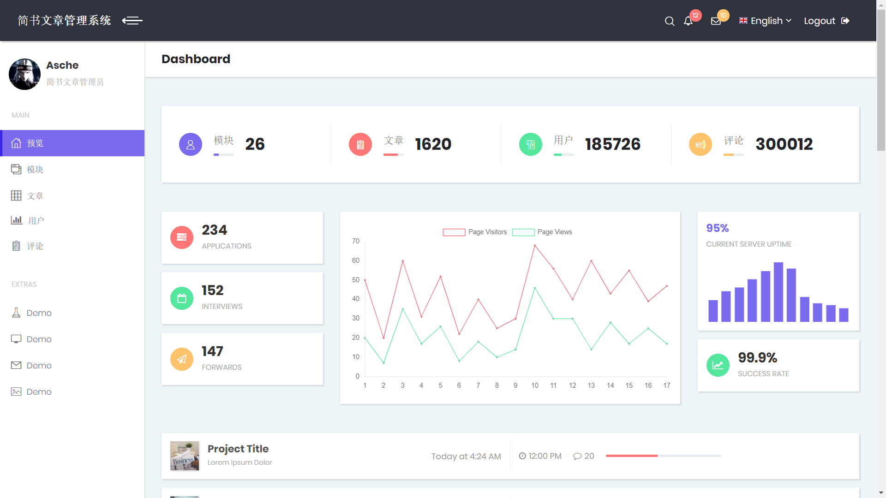
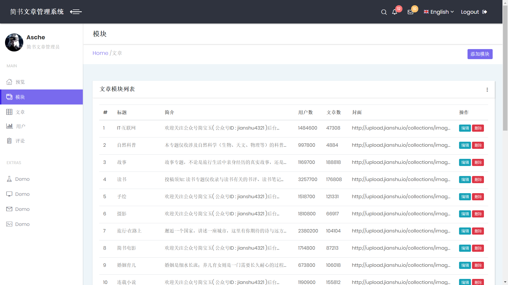
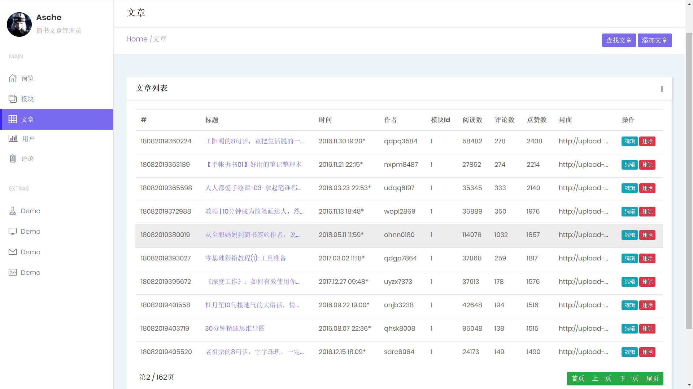

# ArticleManageSystem 

# 简书文章管理系统

数据来于[**SuperSpider**](https://github.com/asche910/SuperSpider)爬虫项目。

针对**简书**爬取了模块、文章、用户、评论等信息。

* **Note**： 数据库文件由于过大，[点这里](https://www.lanzous.com/i6953cf)下载。
* 由于时间仓促，直接使用了某前端模板，故部分页面为模板内容，未做修改。
* **严重申明**: 项目所爬取数据仅用于学习用途！

***

由于数据量过大，某些页面打开耗时严重，可将mysql数据表引擎从默认的Innodb修改为Myisam，访问速度可大幅提升。

项目运行截图如下：

